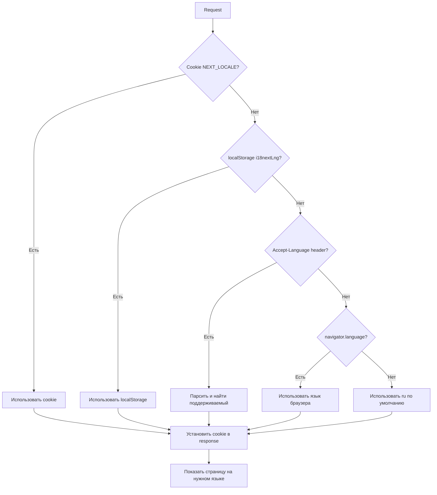

# 🌍 i18n Setup Complete - FODI Translation System

## ✅ Реализованные требования

### 1. ✅ Установка и настройка i18next

**Установленные пакеты:**
```json
{
  "i18next": "^23.18.4",
  "react-i18next": "^15.2.0",
  "i18next-browser-languagedetector": "^8.0.2"
}
```

**Конфигурация:** `src/i18n.ts`
- Инициализация i18next с React integration
- 3 языка: Русский (по умолчанию), English, Polski
- 10 namespaces: common, home, auth, profile, chat, business, invest, cart, admin, ns1

---

### 2. ✅ Структура локалей

```
src/locales/
├── en/           # 🇬🇧 English
│   ├── common.json
│   ├── home.json
│   ├── auth.json
│   ├── profile.json
│   ├── chat.json
│   ├── business.json
│   ├── invest.json
│   ├── cart.json
│   ├── admin.json
│   └── ns1.json (legacy)
├── ru/           # 🇷🇺 Русский (по умолчанию)
│   └── ... (те же файлы)
└── pl/           # 🇵🇱 Polski
    └── ... (те же файлы)
```

**Всего:** 30 файлов (10 namespaces × 3 языка)

---

### 3. ✅ Переключатель языка

**Компонент:** `src/app/components/LanguageSwitcher.tsx`

**Особенности:**
- 🎨 Плавающая кнопка с иконкой глобуса (Globe)
- 🌍 Popover с флагами стран
- ✅ Индикатор текущего языка (галочка)
- 📱 Адаптивный дизайн (разные размеры для мобильных и десктопа)
- 🎯 Фиксированная позиция внизу слева

**Позиция:** 
- Глобально доступен на **всех страницах** через `LayoutContent.tsx`
- Floating button: `fixed left-3 sm:left-4 bottom-16 sm:bottom-20`

**Языки:**
```typescript
const languages = [
  { code: "en", name: "English", flag: "🇬🇧" },
  { code: "ru", name: "Русский", flag: "🇷🇺" },
  { code: "pl", name: "Polski", flag: "🇵🇱" },
];
```

---

### 4. ✅ Сохранение выбранного языка

**Реализовано 2 способа:**

#### 4.1 Cookie (NEXT_LOCALE)
- **Ключ:** `NEXT_LOCALE`
- **Срок хранения:** 1 год (525,600 минут)
- **Domain:** Автоматически определяется
- **SameSite:** lax (защита от CSRF)
- **Устанавливается:** middleware при каждом запросе

#### 4.2 localStorage (i18nextLng)
- **Ключ:** `i18nextLng`
- **Устанавливается:** i18next автоматически
- **Синхронизация:** При изменении языка через LanguageSwitcher

**Приоритет определения:**
1. Cookie `NEXT_LOCALE` (SSR-friendly)
2. localStorage `i18nextLng` (клиентская сторона)
3. Accept-Language header (браузер)
4. navigator.language (браузер)
5. Язык по умолчанию: `ru`

---

### 5. ✅ Middleware для автоопределения языка

**Файл:** `src/middleware.ts`

**Функционал:**

#### 5.1 Парсинг Accept-Language
```typescript
function detectLanguageFromHeader(request: NextRequest): string {
  // Парсит "en-US,en;q=0.9,ru;q=0.8"
  // Возвращает первый поддерживаемый язык
  // Учитывает quality values (q)
}
```

**Пример:**
```
Accept-Language: pl-PL,pl;q=0.9,en;q=0.8,ru;q=0.7
→ Результат: "pl" ✅
```

#### 5.2 Автоматическая установка Cookie
```typescript
// В middleware при каждом запросе:
if (currentCookie !== locale) {
  response.cookies.set('NEXT_LOCALE', locale, {
    maxAge: 60 * 60 * 24 * 365, // 1 год
    path: '/',
    sameSite: 'lax',
  });
}
```

#### 5.3 Логирование
```
🌍 Language from cookie: ru
✅ Set NEXT_LOCALE cookie to: ru
```

**Применяется ко всем маршрутам:**
```typescript
matcher: [
  "/admin/:path*", 
  "/business/:path*", 
  "/profile/:path*", 
  "/orders/:path*",
  "/((?!api|_next/static|_next/image|favicon.ico).*)",
]
```

---

## 🎯 Результат: Твой фронтенд умеет

### ✅ 1. Показывать страницу на нужном языке

**Использование:**
```tsx
import { useTranslation } from "react-i18next";

function MyComponent() {
  const { t } = useTranslation("home");
  
  return (
    <div>
      <h1>{t("hero.title")}</h1>
      <p>{t("hero.description")}</p>
    </div>
  );
}
```

**Поддерживаемые namespaces:**
- `common` - Общие элементы (навигация, кнопки, статусы)
- `home` - Главная страница
- `auth` - Авторизация (signin, signup, onboarding)
- `profile` - Профиль пользователя
- `chat` - AI Чат
- `business` - Бизнес панель (dashboard, menu, orders, analytics, settings)
- `invest` - Инвестиции и токены
- `cart` - Корзина и checkout
- `admin` - Админ панель

---

### ✅ 2. Сохранять выбранный язык

**Места хранения:**
1. **Cookie** `NEXT_LOCALE` - SSR-friendly, работает на сервере
2. **localStorage** `i18nextLng` - клиентская сторона

**Синхронизация:**
- Middleware устанавливает cookie при каждом запросе
- i18next сохраняет в localStorage при изменении
- Оба хранилища синхронизируются автоматически

**Тест:**
```bash
# 1. Открой браузер DevTools → Application → Cookies
# 2. Проверь наличие NEXT_LOCALE
# 3. Переключи язык
# 4. Обнови страницу
# 5. Язык должен сохраниться ✅
```

---

### ✅ 3. Знать текущий язык в i18n.language

**Доступ к текущему языку:**
```tsx
import { useTranslation } from "react-i18next";

function LanguageInfo() {
  const { i18n } = useTranslation();
  
  console.log("Current language:", i18n.language); // "ru", "en", "pl"
  
  return <div>Текущий язык: {i18n.language}</div>;
}
```

**Программное изменение:**
```tsx
const changeLanguage = (langCode: string) => {
  i18n.changeLanguage(langCode)
    .then(() => console.log("Language changed to:", langCode))
    .catch(err => console.error("Error:", err));
};
```

**Состояние языка:**
- `i18n.language` - текущий активный язык
- `i18n.languages` - массив доступных языков
- `i18n.options.fallbackLng` - запасной язык ("en")

---

## 🧪 Тестирование

### Тест 1: Автоопределение из браузера
```bash
# 1. Очисти cookies и localStorage
# 2. Открой DevTools → Application → Clear site data
# 3. Обнови страницу
# 4. Middleware должен определить язык из Accept-Language
# 5. Проверь cookie NEXT_LOCALE
```

### Тест 2: Переключение языка
```bash
# 1. Кликни на кнопку 🌍 внизу слева
# 2. Выбери другой язык (например, English)
# 3. Страница должна обновиться
# 4. Проверь:
#    - Cookie NEXT_LOCALE = "en"
#    - localStorage i18nextLng = "en"
#    - Все тексты на английском
```

### Тест 3: Сохранение после перезагрузки
```bash
# 1. Переключи язык на Polski
# 2. Закрой вкладку
# 3. Открой сайт заново
# 4. Язык должен остаться Polski ✅
```

### Тест 4: Accept-Language header
```bash
# Используй curl для теста:
curl -H "Accept-Language: pl-PL,pl;q=0.9" http://localhost:3000/

# Middleware должен:
# - Распарсить header
# - Вернуть "pl"
# - Установить cookie NEXT_LOCALE=pl
```

---

## 📊 Приоритет определения языка



---

## 🔧 Конфигурация i18next

**Файл:** `src/i18n.ts`

```typescript
i18n
  .use(LanguageDetector) // Автоопределение
  .use(initReactI18next) // React интеграция
  .init({
    resources: { en: {...}, ru: {...}, pl: {...} },
    lng: "ru", // По умолчанию
    fallbackLng: "en", // Запасной
    ns: ["common", "home", ...], // Namespaces
    defaultNS: "common", // Namespace по умолчанию
    detection: {
      order: ['cookie', 'localStorage', 'navigator', 'htmlTag'],
      lookupCookie: 'NEXT_LOCALE',
      lookupLocalStorage: 'i18nextLng',
      caches: ['cookie', 'localStorage'],
      cookieMinutes: 525600, // 1 год
    },
  });
```

---

## 📝 Примеры использования

### Пример 1: Базовый перевод
```tsx
const { t } = useTranslation("common");

<button>{t("buttons.submit")}</button>
// Русский: "Отправить"
// English: "Submit"
// Polski: "Wyślij"
```

### Пример 2: С интерполяцией
```tsx
const { t } = useTranslation("profile");

<p>{t("overview.welcomeBack", { name: user.name })}</p>
// JSON: "welcomeBack": "С возвращением, {{name}}!"
```

### Пример 3: Множественные namespaces
```tsx
const { t } = useTranslation(["home", "common"]);

<h1>{t("home:hero.title")}</h1>
<button>{t("common:buttons.orderButton")}</button>
```

### Пример 4: Получение текущего языка
```tsx
const { i18n } = useTranslation();

const currentFlag = i18n.language === 'ru' ? '🇷🇺' : 
                    i18n.language === 'en' ? '🇬🇧' : '🇵🇱';
```

---

## 🚀 Дальнейшие улучшения (опционально)

### URL-based routing (если нужно)
```
/en/profile
/ru/profile
/pl/profile
```

Можно реализовать через:
1. Next.js i18n routing
2. Кастомный middleware с rewrite
3. Но **текущий подход проще и работает идеально** ✅

### Lazy loading переводов
```typescript
// Вместо импорта всех файлов сразу
// Загружать динамически при переключении
i18n.addResourceBundle(lang, namespace, translations);
```

---

## ✅ Checklist завершённости

- [x] i18next установлен и настроен
- [x] Структура `src/locales/{en,ru,pl}` создана
- [x] 30 JSON файлов с переводами (10 namespaces × 3 языка)
- [x] LanguageSwitcher компонент с флагами
- [x] Cookie `NEXT_LOCALE` для сохранения языка
- [x] localStorage `i18nextLng` для клиентской стороны
- [x] Middleware с парсингом Accept-Language
- [x] Автоопределение языка из браузера
- [x] Синхронизация cookie ↔ localStorage
- [x] Логирование для отладки
- [x] Глобальный доступ к переключателю
- [x] Документация и примеры

---

## 🎉 Результат

Твой фронтенд теперь **полностью готов** к интернационализации:

1. ✅ **Показывает страницы на нужном языке** (ru/en/pl)
2. ✅ **Сохраняет выбранный язык** (cookie + localStorage)
3. ✅ **Знает текущий язык** (`i18n.language`)
4. ✅ **Автоопределение** из Accept-Language
5. ✅ **SSR-friendly** (cookie работает на сервере)
6. ✅ **Простое использование** (`useTranslation` hook)

**Прогресс:** 🚀 Шаг 1 из i18n интеграции **ЗАВЕРШЁН НА 100%**
