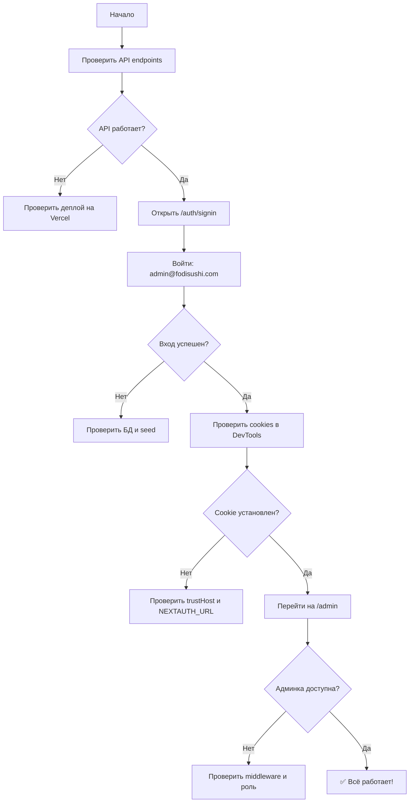

# ✅ Проверка входа на Vercel - Пошаговое руководство

## 🎯 Цель
Убедиться, что аутентификация работает корректно на продакшене (Vercel).

---

## 📋 Предварительные требования

### 1️⃣ Проверьте переменные окружения на Vercel

```bash
# Локально - проверьте, что у вас правильные переменные
cat .env.local | grep -E "NEXTAUTH|DATABASE"
```

**Должны быть:**
- `DATABASE_URL` - строка подключения к Neon
- `NEXTAUTH_URL` - ваш домен Vercel
- `NEXTAUTH_SECRET` - секретный ключ

### 2️⃣ Убедитесь, что админ существует в базе

```bash
# Выполните seed (если ещё не выполнили)
npx prisma db seed

# Откройте Prisma Studio и проверьте
npx prisma studio
```

**Проверьте в таблице User:**
- Email: `admin@fodisushi.com`
- Role: `admin`
- Password: есть (хеш bcrypt)

---

## 🧪 Тестирование на Vercel (Production)

### Шаг 1: Проверка доступности сайта

```bash
# Проверьте, что сайт доступен
curl -I https://menu-fodifood.vercel.app

# Должны получить HTTP/2 200
```

**Ожидаемый результат:**
```
HTTP/2 200
content-type: text/html
server: Vercel
```

---

### Шаг 2: Проверка API endpoints

```bash
# 1. Проверьте health check
curl https://menu-fodifood.vercel.app/api/health

# 2. Проверьте products API
curl https://menu-fodifood.vercel.app/api/products

# 3. Проверьте NextAuth providers
curl https://menu-fodifood.vercel.app/api/auth/providers

# 4. Проверьте debug endpoint
curl https://menu-fodifood.vercel.app/api/debug-auth
```

**Ожидаемые результаты:**

`/api/health`:
```json
{
  "status": "ok",
  "timestamp": "2025-10-05T15:00:00.000Z"
}
```

`/api/products`:
```json
[
  {
    "id": "...",
    "name": "California Roll",
    "price": 450,
    ...
  }
]
```

`/api/auth/providers`:
```json
{
  "credentials": {
    "id": "credentials",
    "name": "credentials",
    "type": "credentials",
    ...
  }
}
```

`/api/debug-auth` (без авторизации):
```json
{
  "timestamp": "2025-10-05T15:00:00.000Z",
  "environment": "production",
  "session": null,
  "cookie": {
    "exists": false,
    "message": "Session cookie not found"
  },
  "env": {
    "NEXTAUTH_URL": "https://menu-fodifood.vercel.app",
    "NEXTAUTH_SECRET_EXISTS": true,
    "DATABASE_URL_EXISTS": true,
    "NODE_ENV": "production"
  },
  "status": {
    "authenticated": false,
    "hasCookie": false
  }
}
```

---

### Шаг 3: Тестирование входа через браузер

#### 3.1 Откройте страницу входа

```
https://menu-fodifood.vercel.app/auth/signin
```

#### 3.2 Откройте Chrome DevTools

1. Нажмите `F12` (Windows) или `Cmd+Option+I` (Mac)
2. Перейдите на вкладку **Network**
3. Включите "Preserve log"

#### 3.3 Войдите с учетными данными

```
Email:    admin@fodisushi.com
Password: admin123
```

Нажмите **Sign In**

#### 3.4 Проверьте Network запросы

В **Network** вкладке должны появиться запросы:

1. **POST** `/api/auth/callback/credentials`
   - Status: `200 OK` или `302 Found`
   - Response: редирект на главную

2. **GET** `/` (после редиректа)
   - Status: `200 OK`
   - Cookies: должен быть `next-auth.session-token`

#### 3.5 Проверьте Cookies

1. Перейдите на вкладку **Application**
2. Слева выберите **Cookies** → `https://menu-fodifood.vercel.app`
3. Найдите `next-auth.session-token`

**Проверьте параметры:**
| Параметр | Значение |
|----------|----------|
| **Name** | `next-auth.session-token` |
| **Value** | Длинная строка (начинается с `eyJ...`) |
| **Domain** | `.menu-fodifood.vercel.app` |
| **Path** | `/` |
| **Expires** | Дата через ~30 дней |
| **HttpOnly** | ✅ |
| **Secure** | ✅ |
| **SameSite** | `Lax` |

---

### Шаг 4: Проверка сессии через Console

Откройте **Console** в DevTools и выполните:

```javascript
// Проверить cookie
document.cookie

// Результат должен включать:
// "next-auth.session-token=eyJ..."
```

```javascript
// Проверить сессию через fetch
fetch('/api/auth/session')
  .then(r => r.json())
  .then(console.log)

// Ожидаемый результат:
// {
//   user: {
//     email: "admin@fodisushi.com",
//     name: "Admin User",
//     role: "admin",
//     id: "..."
//   },
//   expires: "2025-11-04T..."
// }
```

---

### Шаг 5: Проверка доступа к защищённым страницам

#### 5.1 Проверьте личный кабинет

```
https://menu-fodifood.vercel.app/profile
```

**Ожидаемый результат:**
- ✅ Страница отображается
- ✅ Виден email пользователя
- ✅ Кнопка "Sign Out"

**Если редирект на `/auth/signin`:**
- ❌ Сессия не работает
- Проверьте cookies и логи

#### 5.2 Проверьте админ-панель

```
https://menu-fodifood.vercel.app/admin
```

**Ожидаемый результат для ADMIN:**
- ✅ Страница отображается
- ✅ Видна статистика (пользователи, заказы, выручка)
- ✅ Навигация по разделам (Users, Orders)

**Ожидаемый результат для обычного USER:**
- ❌ Редирект на `/auth/signin`
- ❌ Сообщение "Access Denied"

---

### Шаг 6: Проверка через curl (с сессией)

После входа в браузере скопируйте cookie `next-auth.session-token` и используйте его в curl:

```bash
# Замените YOUR_SESSION_TOKEN на реальное значение из DevTools
curl -H "Cookie: next-auth.session-token=YOUR_SESSION_TOKEN" \
  https://menu-fodifood.vercel.app/api/debug-auth
```

**Ожидаемый результат:**
```json
{
  "timestamp": "2025-10-05T15:00:00.000Z",
  "environment": "production",
  "session": {
    "user": {
      "email": "admin@fodisushi.com",
      "name": "Admin User",
      "role": "admin",
      "id": "cm2tqj..."
    },
    "expires": "2025-11-04T15:00:00.000Z"
  },
  "cookie": {
    "exists": true
  },
  "env": {
    "NEXTAUTH_URL": "https://menu-fodifood.vercel.app",
    "NEXTAUTH_SECRET_EXISTS": true,
    "DATABASE_URL_EXISTS": true,
    "NODE_ENV": "production"
  },
  "status": {
    "authenticated": true,
    "hasCookie": true
  }
}
```

---

## 🐛 Проблемы и решения

### ❌ Проблема 1: После входа редирект обратно на `/auth/signin`

**Симптомы:**
- Вводите правильные данные
- Форма отправляется
- Редирект обратно на страницу входа
- Cookie не устанавливается

**Диагностика:**

1. **Проверьте Network в DevTools:**
   - Найдите POST `/api/auth/callback/credentials`
   - Посмотрите на Response Headers
   - Должен быть `Set-Cookie: next-auth.session-token=...`

2. **Проверьте переменные на Vercel:**
   ```bash
   # Проверьте NEXTAUTH_URL
   curl https://menu-fodifood.vercel.app/api/debug-auth | grep NEXTAUTH_URL
   
   # Должно быть: "NEXTAUTH_URL": "https://menu-fodifood.vercel.app"
   ```

3. **Проверьте логи на Vercel:**
   ```bash
   vercel logs --follow
   ```
   
   Ищите:
   - `❌ Failed login attempt` - неверный пароль
   - `❌ User not found` - пользователя нет в БД
   - `✅ Successful login` - вход успешен

**Решения:**

1. **Проверьте `trustHost` в auth.ts:**
   ```typescript
   export const { handlers, signIn, signOut, auth } = NextAuth({
     trustHost: true, // ← Должно быть!
     // ...
   });
   ```

2. **Проверьте `NEXTAUTH_URL` на Vercel:**
   - Vercel → Settings → Environment Variables
   - `NEXTAUTH_URL` = `https://menu-fodifood.vercel.app`
   - Для всех окружений: Production, Preview

3. **Проверьте `NEXTAUTH_SECRET`:**
   - Должен быть установлен
   - Должен совпадать с локальным `.env.local`

---

### ❌ Проблема 2: Cookie устанавливается, но сессия не работает

**Симптомы:**
- Cookie `next-auth.session-token` есть в DevTools
- `/api/auth/session` возвращает `null`
- Редирект на `/auth/signin` при попытке зайти в `/profile`

**Диагностика:**

1. **Проверьте JWT токен:**
   - Скопируйте значение cookie из DevTools
   - Перейдите на https://jwt.io/
   - Вставьте токен
   - Проверьте, что в payload есть `role`, `id`, `email`

2. **Проверьте типы NextAuth:**
   ```bash
   cat src/types/next-auth.d.ts
   ```
   
   Должно быть:
   ```typescript
   interface Session {
     user: {
       id: string;
       role: "user" | "admin";
     } & DefaultSession["user"];
   }
   ```

**Решения:**

1. **Обновите callbacks в auth.ts:**
   ```typescript
   callbacks: {
     async jwt({ token, user }) {
       if (user) {
         token.role = user.role;
         token.id = user.id;
       }
       return token;
     },
     async session({ session, token }) {
       if (session.user) {
         session.user.role = token.role as "user" | "admin";
         session.user.id = token.id as string;
       }
       return session;
     },
   },
   ```

2. **Проверьте middleware:**
   ```bash
   cat src/middleware.ts
   ```

---

### ❌ Проблема 3: "Invalid credentials" при правильных данных

**Симптомы:**
- Email: `admin@fodisushi.com`
- Password: `admin123`
- Ошибка: "Invalid credentials"

**Диагностика:**

1. **Проверьте, что админ существует в БД:**
   ```bash
   npx prisma studio
   ```
   
   Откройте таблицу `User` → найдите `admin@fodisushi.com`

2. **Проверьте логи:**
   ```bash
   vercel logs --follow
   ```
   
   Ищите:
   - `❌ User not found: admin@fodisushi.com` - пользователя нет
   - `❌ Failed login attempt` - неверный пароль

**Решения:**

1. **Пересоздайте админа:**
   ```bash
   # Убедитесь, что DATABASE_URL указывает на Neon
   cat .env.local | grep DATABASE_URL
   
   # Выполните seed
   npx prisma db seed
   ```

2. **Сбросьте пароль через SQL:**
   
   В Neon Console → SQL Editor:
   ```sql
   -- Проверьте, что пользователь существует
   SELECT id, email, name, role FROM "User" WHERE email = 'admin@fodisushi.com';
   
   -- Если нет, создайте (пароль: admin123)
   INSERT INTO "User" (id, email, name, password, role, "createdAt", "updatedAt")
   VALUES (
     gen_random_uuid(),
     'admin@fodisushi.com',
     'Admin User',
     '$2a$10$YourBcryptHashHere', -- используйте хеш из seed.ts
     'admin',
     NOW(),
     NOW()
   );
   ```

---

## ✅ Полный чек-лист проверки на Vercel

### Переменные окружения
- [ ] `DATABASE_URL` установлен (Neon Pooled connection)
- [ ] `NEXTAUTH_URL` = `https://menu-fodifood.vercel.app`
- [ ] `NEXTAUTH_SECRET` установлен (совпадает с локальным)
- [ ] Все переменные для Production и Preview

### База данных
- [ ] Миграции применены (`npx prisma migrate deploy`)
- [ ] Seed выполнен (`npx prisma db seed`)
- [ ] Админ существует (проверено в Prisma Studio)
- [ ] Пароль корректный (bcrypt хеш)

### Код
- [ ] `trustHost: true` в auth.ts
- [ ] Cookies настроены правильно (secure, sameSite, httpOnly)
- [ ] Callbacks jwt и session корректны
- [ ] Типы NextAuth обновлены (next-auth.d.ts)
- [ ] Middleware защищает роуты

### Тестирование
- [ ] API endpoints доступны (/api/health, /api/products)
- [ ] Страница входа открывается (/auth/signin)
- [ ] Можно войти с admin@fodisushi.com / admin123
- [ ] Cookie устанавливается после входа
- [ ] /api/auth/session возвращает данные пользователя
- [ ] /profile доступен после входа
- [ ] /admin доступен только для роли admin
- [ ] Можно выйти (Sign Out работает)

---

## 📊 Тестовые сценарии

### Сценарий 1: Вход администратора

1. Откройте https://menu-fodifood.vercel.app/auth/signin
2. Введите `admin@fodisushi.com` / `admin123`
3. Нажмите Sign In
4. **Ожидается:** Редирект на `/`
5. Перейдите на `/admin`
6. **Ожидается:** Админ-панель отображается
7. Нажмите Sign Out
8. **Ожидается:** Редирект на `/`

### Сценарий 2: Вход обычного пользователя

1. Зарегистрируйтесь на `/auth/signup` или используйте `user@test.com` / `user123`
2. Войдите
3. **Ожидается:** Редирект на `/`
4. Перейдите на `/profile`
5. **Ожидается:** Личный кабинет отображается
6. Попробуйте открыть `/admin`
7. **Ожидается:** Редирект на `/auth/signin` или Access Denied

### Сценарий 3: Неверные учетные данные

1. Откройте `/auth/signin`
2. Введите `wrong@email.com` / `wrongpassword`
3. Нажмите Sign In
4. **Ожидается:** Ошибка "Invalid credentials"
5. Остаётесь на `/auth/signin`

---

## 🔍 Команды для быстрой диагностики

```bash
# 1. Проверить деплой на Vercel
curl -I https://menu-fodifood.vercel.app

# 2. Проверить API
curl https://menu-fodifood.vercel.app/api/health
curl https://menu-fodifood.vercel.app/api/products
curl https://menu-fodifood.vercel.app/api/auth/providers

# 3. Проверить debug endpoint (без авторизации)
curl https://menu-fodifood.vercel.app/api/debug-auth

# 4. Проверить сессию (без авторизации)
curl https://menu-fodifood.vercel.app/api/auth/session

# 5. Посмотреть логи Vercel
vercel logs --follow

# 6. Проверить переменные окружения
vercel env ls

# 7. Проверить БД
npx prisma studio
```

---

## 🎓 Итоговый алгоритм проверки



---

**Обновлено:** 5 октября 2025 г.
